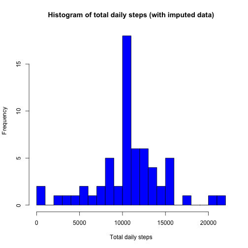

Peer Assessments for Reproducible Research 
=============================================
The data was obtained from https://d396qusza40orc.cloudfront.net/repdata%2Fdata%2Factivity.zip
Time: May 17, 2015

First I loaded the csv file, and the dplyr package and ggplot2 package I will need later

```r
library(dplyr)
library(ggplot2)
activity<- read.csv("activity.csv")
summary(activity)
```

```
##      steps                date          interval     
##  Min.   :  0.00   2012-10-01:  288   Min.   :   0.0  
##  1st Qu.:  0.00   2012-10-02:  288   1st Qu.: 588.8  
##  Median :  0.00   2012-10-03:  288   Median :1177.5  
##  Mean   : 37.38   2012-10-04:  288   Mean   :1177.5  
##  3rd Qu.: 12.00   2012-10-05:  288   3rd Qu.:1766.2  
##  Max.   :806.00   2012-10-06:  288   Max.   :2355.0  
##  NA's   :2304     (Other)   :15840
```
From the summary we can see that the date values are read in as factors. I would like to change them into dates. 

```r
activity$date<- as.Date(activity$date)
```

Then I would like to answer the first set of question: 
1, Total number of steps taken per day
2, Histogram of the total number of steps each day
3, Mean and Median of total number of steps taken perday. 


```r
totalstep<- activity %>% select(steps, date) %>% group_by(date) %>% summarize(total=sum(steps))
hist(totalstep$total,breaks=20, col="darkgrey", main="Total steps per day", xlab="Total steps")
```

 

```r
Mean<- mean(totalstep$total, na.rm=T)
Median<- median(totalstep$total, na.rm=T)
```
Therefore the mean of the total number of daily steps is 1.0766189 &times; 10<sup>4</sup>, and the median is 10765. 

Now is the second part of the assessment. The questions are:
1, Make a time series plot of 5-minute interval and the average steps
2, Identify the 5-min interval that has maximum number of steps. 

```r
intervalstep<- activity %>% group_by(interval) %>% summarize(average=mean(steps, na.rm=T)) 
plot(intervalstep$interval, intervalstep$average, type="l",col="red",lwd=2, main="Time series of average steps", xlab="5-min interval", ylab="Average steps")
```

 

```r
Max<- max(intervalstep$average)
Maxinter<- intervalstep[intervalstep$average==Max,1]
```
Therefore, the interval that has maximum average step is 835. 

Now is the third part, imputing missing values. 
1, Report total number of missing values in the dataset
2, Fill in the missing value. I will use the mean of the corresponding interval. 
3, Make a new histogram and calculate mean and median. 

```r
Missingnum<- sum(is.na(activity))
Missing<- activity[is.na(activity$steps),]
Missing2<- merge(Missing, intervalstep)
Missing2<- Missing2[,-2]
names(Missing2)[3]='steps'
activitynew<- rbind(na.omit(activity), Missing2)
total2<- activitynew %>% select(steps, date) %>% group_by(date) %>% summarize(total=sum(steps))
hist(total2$total, breaks=20, col="blue", main="Histogram of total daily steps (with imputed data)", xlab="Total daily steps")
```

 

```r
Mean2<- mean(total2$total)
Median2<- median(total2$total)
```
Before imputing missing data, the total number of missing value is 2304. 
After imputation, we can see that the new mean is 1.0766189 &times; 10<sup>4</sup>, and the new median is 1.0766189 &times; 10<sup>4</sup>. The mean stayed the same as before, but the median changed slightly. The histogram, however, looks quite different from the previous one. The frequency of the bar for 10000~11000 steps significantly increased. This is because that I used the average step number for a certain interval to impute the missing data, so the average value is 'enhanced' and the frequency increased 

Now come the last part of the assessment. The challenge is to make a time series plot for average steps on weekdays and weekend. 

```r
weekday<- weekdays(activitynew$date)
weekend<- weekday %in% c("Saturday", "Sunday")
Cat<- rep("Weekday", length(weekday))
Cat[weekend]="Weekend"
activitynew2<- cbind(activitynew, Cat)
interval2<- activitynew2 %>% group_by(Cat, interval) %>% summarize(average=mean(steps))
g<- qplot(interval, average, data=interval2, facets=Cat~., geom="line")
g+labs(title="Average steps across interval", x="Interval", y="Number of steps")
```

 


